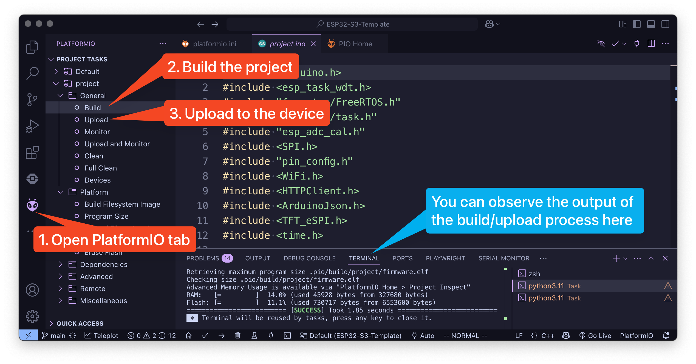

# ESP32-S3-Template

Welcome to the lab using the ESP32-S3 LilyGO!

This repository serves as a foundation for software engineering projects aimed at the ESP32 hardware.
This document will guide you through the setup process and help you prepare to work with your ESP32 hardware.

---

# How to get started

This project will work regardless of the operating system you use, and there are appended guides for each below.
Each of these tutorials is done on a fresh install of Visual Studio Code, which is the IDE you must use to complete this project.
Setting up and configuring the project will take multiple minutes, up to 15 min so be patient with the software.

## General

1. Install Visual Studio Code
   * Visit [Visual Studio Code's website](https://code.visualstudio.com/download) and download the latest version or use the package manager of your system.
   * Run `Visual Studio Code` and follow the steps.
2. Install the correct extension.
   * Head over to the extensions tab on your left.
   * Search for ["PlatformIO IDE"](https://marketplace.visualstudio.com/items?itemName=platformio.platformio-ide) and install it.

## Windows

3. Install the Clang compiler and C++ extension for Visual Studio Code.
   * (optional) If you want/need to use Windows Subsystem for Linux (WSL) have at the [documentation](https://code.visualstudio.com/docs/remote/wsl).

## Linux

3. Install the Clang compiler and C++ extension for Visual Studio Code.

4. Run the following command to add access to the `ttyACM0` port in order to avoid complications [1]
   * `sudo adduser $USER $(stat --format="%G" /dev/ttyACM0 )`

## MacOS

3. Run `git -v` in the Terminal app to check whether git and the macOS command line tools are installed. If the command line tools are not installed, a pop up will appear to install it.

## How to run the program

1. Open the locally cloned repository with Visual Studio Code
    * If the "Do you trust the authors of the files in this folder?" dialog appears, click on "Yes, I trust the authors"
2. Open up the file `project/project.ino`
3. Connect your ESP32 to your computer via a USB cable.
4. Build and upload the project to the device. See screenshot.

](./assets/screenshot.png)

---

## What to add where

Your code belongs in one file and one file only. The only place you should add, change, or remove things from is the [**project.ino**](project/project.ino) file in the `project` folder. Changing anything else might break the code and cause a lot of headaches for all involved parties.

## Areas of addition

You are meant to write a small application for the computer that retrieves the weather for a given location, and most of that code belongs in your own functions and the `void loop()` function at the bottom of the `project.ino` file.

## How to Connect to WiFi

The ESP32-S3 LilyGO has a built-in WiFi module, which allows you to connect to the internet.
However, it does not work with eduroam, so you will need to connect to a different WiFi network.
To connect to WiFi, you need to provide your SSID and password in the [project/project.ino](./project/project.ino) file.

## References

[1] This command adds the current user ($USER) to the group that owns the /dev/ttyACM0 device.
**Breakdown**:

* `sudo`: Runs the command with superuser (root) privileges.
* `adduser` `$USER`: Adds the current user to a specified group.
* `$(stat --format="%G" /dev/ttyACM0)`: retrieves the group name that owns the /dev/ttyACM0 device.
* `$()`: executes this command and substitutes its output.

Purpose: This is useful when working with serial devices (like Arduino or other USB-connected hardware). By adding yourself to the device's group, you gain permission to access `/dev/ttyACM0` without needing sudo every time.
